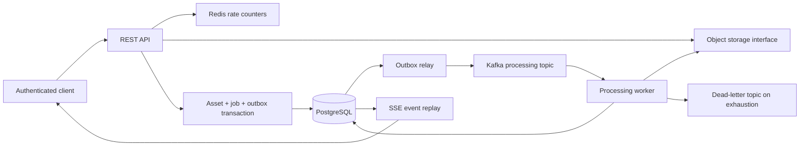

# Distributed Digital Asset Processing Platform

A Java 21 backend for authenticated JPEG, PNG and PDF uploads, durable Kafka processing, metadata extraction and replayable status events. It focuses on correctness under concurrency and partial failure: an accepted upload has a database receipt, one processing job and a transactional outbox event.

This is a portfolio implementation with a local deployment configuration, not a claim of production operation. Read [verification results](docs/VERIFICATION.md) for what was actually executed and what remains unverified.

## Engineering Highlights

- **Transactional outbox:** atomic acceptance, concurrent relay polling, durable publish retries and tested recovery from a rollback after broker acknowledgement.
- **Concurrency controls:** owner-scoped request idempotency and SHA-256 content deduplication, database constraints, pessimistic aggregate locks and optimistic versions.
- **Duplicate-safe workers:** a database advisory lock spans independently committed start/result transactions; overlapping deliveries do not spend the active worker's retry budget.
- **Secure REST boundaries:** JWT ownership, salted password hashes, strict JSON and upload validation, shared Redis rate limits and operator-scoped metrics.
- **Streaming algorithms:** fixed-buffer hashing and KMP PDF marker matching; metadata parsing remains off the request path.
- **Executable evidence:** real PostgreSQL/Kafka integration tests, Testcontainers contract, fault injection, CI and a reproducible benchmark driver.

**Start locally:** `node scripts/init-local-env.mjs`, then `docker compose up --build --wait` and `node scripts/smoke.mjs`. See [Running Locally](#running-locally) for prerequisites. [Current verification](docs/VERIFICATION.md) distinguishes executed checks from Docker limitations. [Engineering review](docs/REVIEW.md) explains the hardening decisions; [role evidence](docs/ADOBE_ROLE_ALIGNMENT.md) maps implemented skills and remaining gaps.

## Architecture

One Spring Boot codebase contains API, relay and worker modules. PostgreSQL owns durable state. Kafka separates uploads from parsing. A local object-storage adapter uses immutable UUID keys and can be replaced behind an interface. Redis implements a shared, atomic request-rate limit. SSE reads durable status history.

## Architecture Diagram



## Request Lifecycle

1. Validate a JWT and rate limit the signed user identity.
2. Validate the filename; stream bytes to an opaque storage key with a byte limit and SHA-256 digest; compare magic bytes to the declared media type.
3. In one PostgreSQL transaction, serialize an optional idempotency key and create the asset, job, initial status event and outbox record.
4. Return 202 with a stable creation receipt and a Location header.
5. The relay publishes the outbox event and waits for Kafka acknowledgement.
6. A worker commits PROCESSING, verifies the bytes again, parses bounded image dimensions or PDF page count, and atomically records COMPLETED, DUPLICATE or REJECTED. Infrastructure failures enter bounded delivery retries and can end in FAILED.
7. GET status returns authoritative database state; SSE replays status history after a client cursor.

Uploads stream before their database transaction; no partially uploaded asset is exposed through the API. UPLOADING is a reserved enum value, not an externally persisted upload-progress state.

## Technology Stack

Java 21; Spring Boot 3.5; Maven; Spring Web; JPA/Hibernate; Spring Security resource-server JWT support; PostgreSQL/Flyway; Spring Kafka; Redis; PDFBox; Actuator/Micrometer/Prometheus; springdoc OpenAPI; JUnit 5, Mockito and Testcontainers; Docker Compose. [Dependency decisions](docs/DEPENDENCIES.md) record security patches beyond the Spring Boot BOM.

## Core Engineering Decisions

- **Database constraints plus locks:** owner/key uniqueness and advisory transaction locks cover first-insert races. One job per asset and owner/digest uniqueness enforce durable invariants.
- **SSE:** status delivery is one-way. Last-Event-ID and a database event log support reconnects across API instances without routing all clients through a single in-memory broadcaster. Streams close after a terminal event, token expiry or 60 seconds; clients reconnect with their cursor.
- **Explicit DTOs:** REST responses exclude password hashes, storage keys and JPA internals.
- **A small storage interface:** local files work in Compose through a named volume. No unused cloud SDK or fabricated S3 deployment.
- **Streaming KMP:** PDF end-marker checks carry partial matches between buffers in linear time. See [algorithms](docs/ALGORITHMS.md).

## Event-Driven Processing

Events contain a schema version and UUIDs for the event, asset and job. Consumers verify all three against database state. Unknown versions, malformed JSON, oversized envelopes and unrelated IDs are quarantined. The job lock protects final transitions and content-fingerprint insertion. Delivery is **at least once**; no end-to-end exactly-once claim is made.

## Transactional Outbox

The asset, job, initial event and processing outbox row commit together. Relays select due rows with FOR UPDATE SKIP LOCKED. A crash between broker acknowledgement and database commit can publish a duplicate, which the worker tolerates. Broker outages leave rows pending with capped exponential backoff; outbox retries are durable and not abandoned after a fixed count. Worker delivery retries are separately bounded.

The relay holds a database connection during the broker wait. Worker coordination uses one connection for the advisory lock and another for the current start/result transaction. Parser resource limits do not constitute a hard wall-clock timeout. These throughput and isolation trade-offs are described in [architecture](docs/ARCHITECTURE.md).

## Idempotency vs Content Deduplication

**Request idempotency** answers “Did this client operation already succeed?” An optional UUID Idempotency-Key is scoped to the signed owner. The request fingerprint includes sanitized filename, detected type, byte count and content hash. Concurrent matching requests return the same creation receipt and create one job. Different input under the same key returns 409. Receipts survive soft deletion; timestamps use PostgreSQL-compatible microsecond precision.

**Content deduplication** answers “Has this owner already successfully processed these bytes?” Separate requests still create separate assets and jobs. After successful validation, the first owner/SHA-256 fingerprint wins; subsequent matches finish as DUPLICATE and reference the canonical asset. This does not share storage objects or reveal another user's content.

## Security

Salted PBKDF2 password hashes, 15-minute signed JWTs with issuer/audience/expiry checks, server-side ownership, safe errors, strict JSON, filenames, file signatures, streaming limits and Redis rate limits are implemented. Swagger is opt-in; health has no details; metrics require the `metrics.read` scope, which ordinary login tokens do not receive; other actuator endpoints are blocked. No wildcard CORS is configured.

Compose binds only the application port to loopback. It is a local environment: TLS termination, Kafka authentication, tenant storage quotas, parser process isolation, key rotation and operational retention policies are required before an Internet-facing deployment. See [SECURITY.md](SECURITY.md) and the [threat model](docs/THREAT_MODEL.md).

## Testing

```sh
java -version
mvn -version
mvn clean verify
```

JUnit/Mockito tests cover domain transitions, validation, streaming storage, the algorithm, metadata parsing, rate protection and recovery behavior. The shared integration contract covers PostgreSQL migrations, real Kafka delivery, REST/security, simultaneous idempotency requests, deduplication, replay, deletion, outbox failure and retry exhaustion.

With Docker, ContainerPlatformIT starts PostgreSQL, Kafka and Redis through Testcontainers. Without Docker it reports skipped tests. CI first requires Docker so unavailable infrastructure cannot silently pass the integration gate. An optional LocalPlatformIT uses an externally supplied **dedicated test PostgreSQL database** and an embedded real Kafka broker; only Redis rate limiting is mocked in that runner. Set TEST_DATABASE_URL, TEST_DATABASE_USER and TEST_DATABASE_PASSWORD to enable it. Never point it at a database containing user data.

Actual outcomes are recorded in [docs/VERIFICATION.md](docs/VERIFICATION.md). Coverage reports are generated under target/site/jacoco; no coverage percentage is claimed here.

## Observability

Logs are structured JSON and HTTP responses carry X-Request-ID. Workers log event and asset IDs, not file bodies or tokens. Metrics include asset_upload_total (created/replayed), asset_processing_total (committed terminal status), asset_processing_duration_seconds (delivery attempts, including duplicate/no-op and failed attempts), asset_outbox_publish_total (committed relay outcomes, including object cleanup), asset_outbox_transaction_failures_total, asset_deadletter_total and asset_rate_limit_total. Labels have bounded cardinality; no user or asset ID appears as a metric label.

GET /actuator/health exposes aggregate database/Redis/disk health without details; it is not a guarantee of Kafka delivery or parser availability. GET /actuator/prometheus requires a trusted issuer's bearer token with `scope: metrics.read`; self-registration cannot grant this scope. Scraper credential provisioning remains an operator task; restrict management access at the gateway as well. Alert on sustained outbox retries, failed/dead-letter processing, database health and object-volume capacity. Outbox backlog/age gauges and cross-service tracing remain gaps.

## API

| Method | Path | Behavior |
| --- | --- | --- |
| POST | /api/v1/auth/register | Create account and access token |
| POST | /api/v1/auth/login | Issue access token |
| POST | /api/v1/assets | Multipart upload; optional Idempotency-Key; 202 |
| GET | /api/v1/assets | Bounded pagination, allowlisted sort, status/mediaType filters |
| GET | /api/v1/assets/{id} | Owned asset and extracted metadata |
| DELETE | /api/v1/assets/{id} | Tombstone plus durable object cleanup; 204 |
| GET | /api/v1/assets/{id}/status | Authoritative processing status |
| GET | /api/v1/assets/{id}/events | Authenticated SSE replay |

See [API examples and error semantics](docs/API.md). Local Compose enables [Swagger UI](http://localhost:8080/swagger-ui/index.html); authorize there with a login token.

## Running Locally

Install Docker with Compose. Java 21 and Maven 3.9+ are needed for host-side tests; Node.js 20+ is used only by convenience, audit and benchmark scripts.

```sh
node scripts/init-local-env.mjs
docker compose config --quiet
docker compose up --build --wait
node scripts/smoke.mjs
```

The environment initializer creates fresh secrets and refuses to overwrite an existing .env. Without Node, copy .env.example to .env and replace every placeholder; JWT_SECRET must be Base64 of at least 32 cryptographically random bytes. Do not commit that file. Default API: http://localhost:8080. Defaults: 20 MiB/file, 21 MiB multipart request, 16 KiB auth JSON, 16 million decoded image pixels, 2,000 PDF pages, 120 authenticated requests/minute, 10 auth requests/minute per direct client IP, 100 SSE streams per process.

For host execution, supply DATABASE_URL, DATABASE_USER, DATABASE_PASSWORD, REDIS_HOST, REDIS_PASSWORD, KAFKA_BOOTSTRAP_SERVERS and JWT_SECRET, then run mvn spring-boot:run. The base Compose file intentionally does not publish infrastructure ports. File limits can be configured through Spring environment properties; keep the storage, servlet and proxy limits consistent.

## Docker

A multi-stage Dockerfile builds the jar and runs it as UID 10001. Compose supplies PostgreSQL, Kafka in KRaft mode, Redis and a shared local object volume. Service names are used for container connections. Health checks gate startup. The application uses a read-only root filesystem, writable temporary storage and dropped Linux capabilities.

WORKER_ENABLED=false disables consumption; OUTBOX_ENABLED=false disables the relay. These flags support role separation in deployments sharing PostgreSQL, Kafka and object storage. Compose starts one application process with two consumer threads; it does not provide a multi-host deployment or load balancer. Kafka replication factor 1 is a local-development setting, not fault-tolerant broker storage.

Use docker compose down to stop. Named volumes retain bytes and database state. Removing volumes permanently deletes local data and is deliberately not part of the normal stop command.

## Project Structure

```text
src/main/java/dev/assetplatform/
  config/ controller/ dto/ domain/ repository/
  service/ security/ messaging/ worker/ storage/
  exception/ validation/ observability/
src/main/resources/db/migration/
src/test/java/dev/assetplatform/
  integration/ messaging/ worker/ security/ storage/ validation/ domain/
docs/        architecture, API, algorithms, security and verification
scripts/     local environment, smoke test and dependency audit
benchmarks/  reproducible HTTP load driver and fixture
```

## Failure Handling

| Failure | Result |
| --- | --- |
| Kafka unavailable | Accepted uploads remain in the database outbox; retry delay caps at 60 seconds |
| Crash after publish, before marking outbox | Same event may be published again; terminal-state guards prevent repeat effects |
| Worker crash after PROCESSING | Final transaction rolls back; a subsequent delivery can restart processing |
| Duplicate event | Verified job and locked terminal state make it a no-op |
| Overlapping delivery before the result transaction | Advisory lock returns a retryable contention error; no attempt increment or DLT publication |
| Temporary processing I/O failure | Initial delivery plus three retries, one second apart; persisted job budget also bounds restarts |
| Retry exhaustion | Publish to DLT, then mark correlated job FAILED; recovery failure prevents acknowledgement |
| Invalid content | REJECTED without retry; no canonical content fingerprint |
| Malformed event | DLT quarantine without changing an arbitrary asset; consumer continues |
| PostgreSQL failure | HTTP fails safely or Kafka handling is retried; recovery cannot acknowledge until durable work succeeds |
| Redis failure | Protected API traffic returns 503; status itself remains in PostgreSQL |
| Object-store/DB partial failure | Known rollbacks clean uploaded bytes; crash or unknown commit outcome can leave an orphan for reconciliation |

Kafka retention, outbox/event retention and disk capacity need operational monitoring. A worker outage exceeding topic retention requires an operator to replay a stored outbox payload. Do not delete pending outbox rows to clear a backlog.

## Performance / Benchmarking

[benchmarks/README.md](benchmarks/README.md) explains the Node.js load driver, concurrency, duration and output. It has **not been executed against the complete Compose environment on this machine**, and no throughput or production capacity is claimed. Correctness tests are not benchmarks.

## Future Improvements

S3 adapter and orphan reconciliation; tenant storage quotas; isolated parser processes; token rotation/revocation and account lifecycle; multi-broker security/replication; cursor pagination; retention jobs; trace propagation across Kafka; external load-balancer and SSE capacity controls; measured capacity planning. These are explicit gaps, not implemented features.
